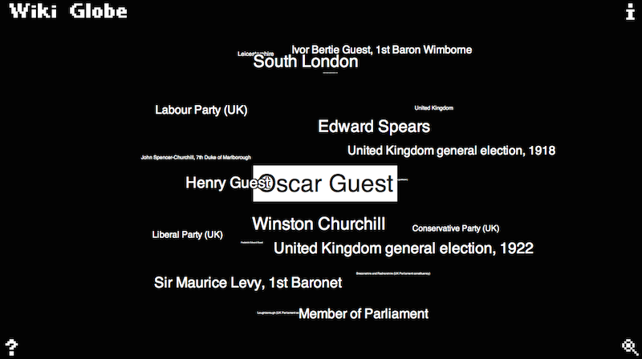

# Wiki Globe

[**Click here to see the demo**](http://nurgak.github.io/WikiGlobe/)

Wiki Globe is a graphical design project. It uses the [Wikipedia API](http://en.wikipedia.org/w/api.php) to fetch a random article, extracts all the links on that page and forms a sphere with the current article title in the center and linked articles all around it.

The sphere can be moved around using the mouse or finger on a touch screen device. If the center link is clicked the actual Wikipedia page opens in a frame, this frame can be then closed to continue exploring Wikipedia using the sphere.

If the links around the sphere are clicked then it becomes the new center article and the script fetches all the links on that page and displays them around.

On some devices, such as tablets, showing too many links is too calculation intensive, so the total number of links at any moment is limited. If the article has more links than this limit they will be selected randomly.

# Functions

Additional functions are displayed in the 4 corners of the screen. Clicking the Wiki Globe logo will make the articles orbit the center point in a pseudo-random way. The question mark will fetch a random article, the `i` displays the about window and finally the magnifier shows a search dialog.

# Version log

## 1.0 (2014-05-28)

* Initial version.

# Licence

This software is published under [LGPL](http://www.gnu.org/licenses/lgpl.html).
